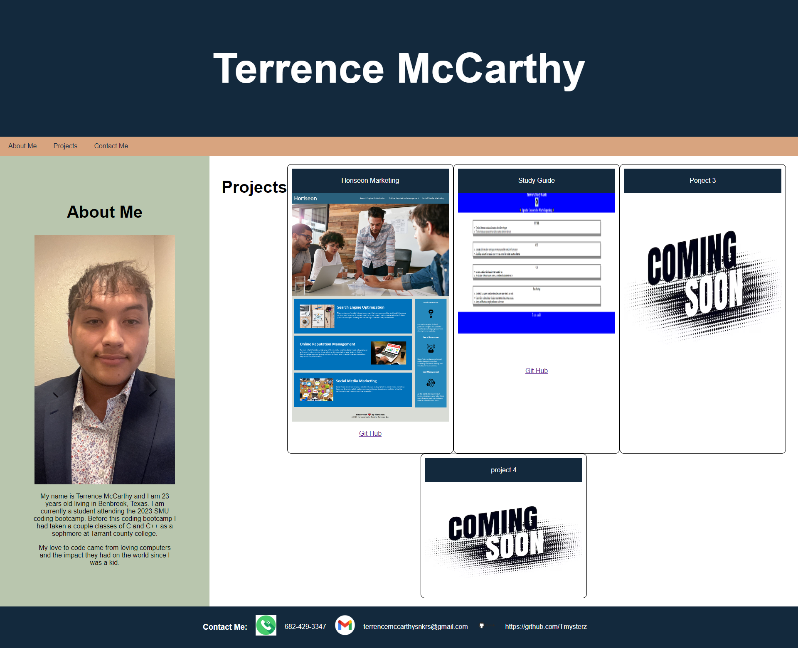

# Pro-Portfolio

* Description 

In this project I created a professional portfolio for my self that an actual employer would be able to view. The main aspects of this portfolio are working navigational links to different parts of the website, clear description and introduction of who I am. Once we reach the work section of the portfolio I created titled blurred images of my work. Hovering over the image will show a screenshot of the application and clicking on the image will take you to the actual deployed application. Ending the portfolio is a footer I created with my phone number, email and github.

* Screenshot

* Deployed Application 

[Portfolio](https://tmysterz.github.io/Pro-Portfolio/)